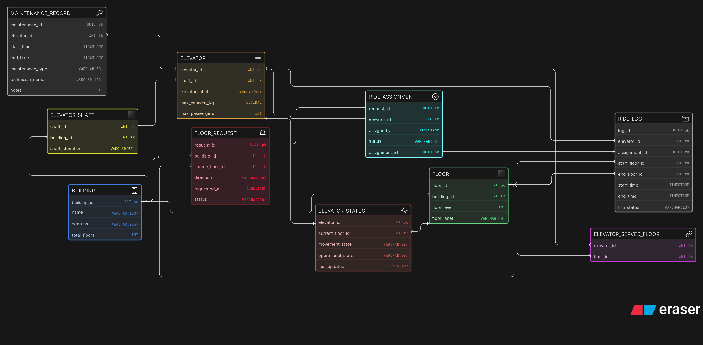

# Smart Elevator Control System — Database Design

---

## What's this about?

This one models a smart elevator system for a building — think of it like the backend that decides which elevator answers your call, tracks where each elevator is in real time, logs every trip, and keeps maintenance records. It's more complex than it looks because you have to separate the physical structure (building → shaft → elevator) from the operational side (requests, assignments, ride logs).

---

## Entities

| Entity | What it represents |
|---|---|
| `BUILDING` | The physical building |
| `FLOOR` | Each floor in a building |
| `ELEVATOR_SHAFT` | The shaft — physical slot in the building |
| `ELEVATOR` | The actual elevator car inside a shaft |
| `ELEVATOR_SERVED_FLOOR` | Junction — which elevator serves which floors |
| `ELEVATOR_STATUS` | Real-time state of each elevator (current floor, moving/idle) |
| `FLOOR_REQUEST` | Someone pressed the call button on a floor |
| `RIDE_ASSIGNMENT` | System assigned an elevator to handle a request |
| `RIDE_LOG` | Archived record of a completed trip |
| `MAINTENANCE_RECORD` | Downtime and service logs per elevator |

---

## Relationships

- `BUILDING` → `FLOOR`, `ELEVATOR_SHAFT`, `FLOOR_REQUEST` → `1:N`
- `ELEVATOR_SHAFT` → `ELEVATOR` → `1:1` (one shaft, one car)
- `ELEVATOR` ↔ `FLOOR` via `ELEVATOR_SERVED_FLOOR` → `M:N` junction table
- `ELEVATOR` → `ELEVATOR_STATUS` → `1:1` (live status per elevator)
- `FLOOR` → `FLOOR_REQUEST` → `1:N`
- `FLOOR_REQUEST` → `RIDE_ASSIGNMENT` → `1:1`
- `ELEVATOR` → `RIDE_ASSIGNMENT` → `1:N`
- `RIDE_ASSIGNMENT` → `RIDE_LOG` → `1:1`
- `ELEVATOR` → `RIDE_LOG` → `1:N`
- `ELEVATOR` → `MAINTENANCE_RECORD` → `1:N`

---

## Keys at a glance

- `BUILDING.building_id` → PK (INT)
- `ELEVATOR_SHAFT.building_id` → FK to `BUILDING`
- `ELEVATOR.shaft_id` → FK to `ELEVATOR_SHAFT`
- `ELEVATOR_SERVED_FLOOR` → composite FK on `elevator_id` + `floor_id`
- `FLOOR_REQUEST.request_id` → PK (UUID)
- `RIDE_ASSIGNMENT.request_id` → FK to `FLOOR_REQUEST`
- `RIDE_LOG.assignment_id` → FK to `RIDE_ASSIGNMENT`

---

## Design decisions worth noting

- Shaft and elevator are separated — a shaft is a physical slot, the elevator is the car. Useful if a car is swapped out
- `ELEVATOR_SERVED_FLOOR` handles the M:N — not every elevator goes to every floor (think service elevators, express lifts)
- `ELEVATOR_STATUS` is a separate 1:1 table for real-time polling — keeps the main elevator table clean
- `RIDE_LOG` is the archive — once a trip is done, it moves here from `RIDE_ASSIGNMENT`

---

## ERD Notation

Built using **crow's foot notation**, pastel color mode, shadow style.
