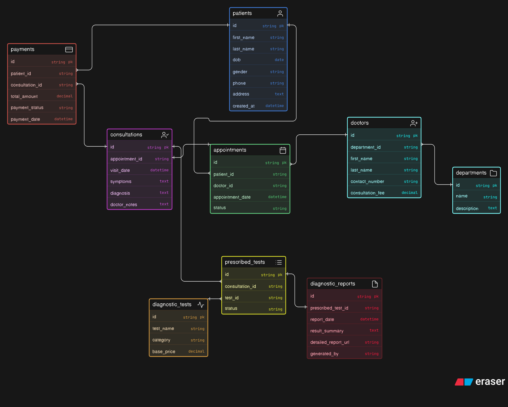

# Clinic Appointment & Diagnostics — Database Design

---

## What's this about?

A clinic system where patients book appointments with doctors, get seen, have tests prescribed, and then pay a combined bill. The tricky part was separating **booking** from the **actual visit** — those are two different things and they deserve two different tables. A lot of designs collapse them into one, which causes problems later.

---

## Entities

| Entity | What it represents |
|---|---|
| `patients` | People visiting the clinic |
| `departments` | Specialties like Cardiology, Radiology, etc. |
| `doctors` | Doctors, each belonging to a department |
| `appointments` | The scheduled booking — can be cancelled, no-show, etc. |
| `consultations` | The actual visit — symptoms, diagnosis, doctor notes |
| `diagnostic_tests` | Catalog of available tests with base price |
| `prescribed_tests` | Tests ordered during a specific consultation (junction table) |
| `diagnostic_reports` | The result/report generated for each prescribed test |
| `payments` | Combined bill per consultation (fee + tests) |

---

## Relationships

- `departments` → `doctors` → `1:N` (one dept, many doctors)
- `patients` → `appointments` → `1:N`
- `doctors` → `appointments` → `1:N`
- `appointments` → `consultations` → `1:1` (one booking = one visit max)
- `consultations` → `prescribed_tests` → `1:N` (one visit, many tests)
- `diagnostic_tests` → `prescribed_tests` → `1:N` (test catalog entry used many times)
- `prescribed_tests` → `diagnostic_reports` → `1:1` (each test order gets one report)
- `patients` → `payments` → `1:N`
- `consultations` → `payments` → `1:N` (bill tied to the visit)

---

## Keys at a glance

- All PKs are `string` (UUID-style)
- `doctors.department_id` → FK to `departments.id`
- `appointments.patient_id` / `appointments.doctor_id` → FKs to respective tables
- `consultations.appointment_id` → FK to `appointments.id`
- `prescribed_tests.consultation_id` + `prescribed_tests.test_id` → FKs
- `diagnostic_reports.prescribed_test_id` → FK to `prescribed_tests.id`
- `payments.patient_id` + `payments.consultation_id` → FKs

---

## Design decisions worth noting

- `appointments` and `consultations` are intentionally split — booking is not the same as the visit
- `prescribed_tests` is a proper junction table between consultations and the test catalog
- `diagnostic_reports` is separate from `prescribed_tests` — the order and the result are different things
- Payment is tied to `consultation_id` so the bill covers both the doctor fee and all test fees from that visit

---

## ERD Notation

Built using **crow's foot notation**, pastel color mode.
