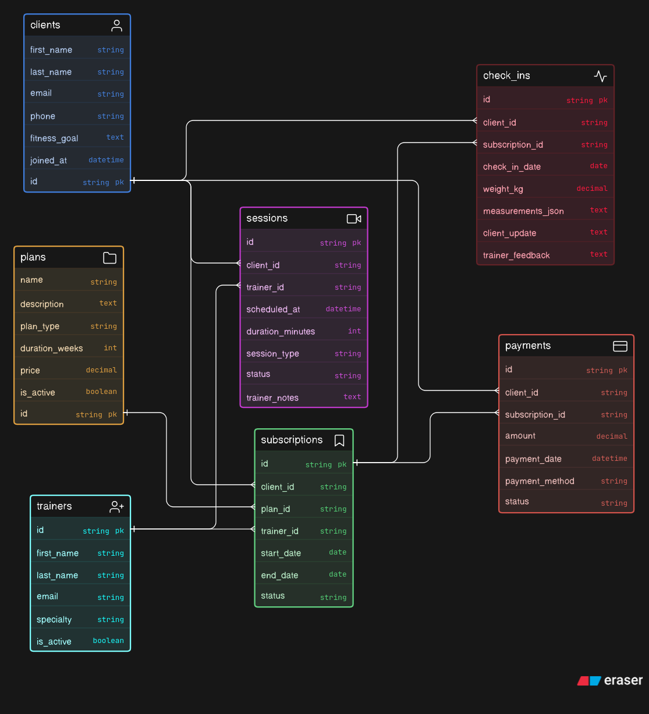

# Online Fitness Coaching Platform — Database Design

---

## What's this about?

An online coaching platform where trainers offer fitness plans, clients subscribe to them, attend live sessions, submit weekly check-ins, and pay for their programs. The interesting design challenge here is that a subscription ties together a client, a plan, AND a trainer — so it's not just a simple M:N between clients and plans.

---

## Entities

| Entity | What it represents |
|---|---|
| `trainers` | Coaches on the platform — specialty, active status |
| `clients` | People buying coaching — fitness goals, contact info |
| `plans` | The coaching packages offered — type, duration, price |
| `subscriptions` | A client enrolled in a plan with a specific trainer |
| `sessions` | Live video calls — consultations, workouts, check-in calls |
| `check_ins` | Weekly async progress updates from clients |
| `payments` | Payment per subscription |

---

## Relationships

- `trainers` → `subscriptions` → `1:N`
- `clients` → `subscriptions` → `1:N`
- `plans` → `subscriptions` → `1:N`
- `subscriptions` acts as the 3-way junction between clients, plans, and trainers
- `trainers` → `sessions` → `1:N`
- `clients` → `sessions` → `1:N`
- `clients` → `check_ins` → `1:N`
- `subscriptions` → `check_ins` → `1:N` (progress tied to a specific program)
- `clients` → `payments` → `1:N`
- `subscriptions` → `payments` → `1:N`

---

## Keys at a glance

- All PKs are `string` (UUID-style)
- `subscriptions.client_id`, `subscriptions.plan_id`, `subscriptions.trainer_id` → all FKs
- `sessions.client_id` + `sessions.trainer_id` → FKs
- `check_ins.client_id` + `check_ins.subscription_id` → FKs
- `payments.client_id` + `payments.subscription_id` → FKs

---

## Design decisions worth noting

- `subscriptions` is more than just a junction table — it has its own lifecycle (`active`, `completed`, `cancelled`) and links a trainer to a specific client-plan combo
- `sessions` are separate from check-ins — live calls vs async updates are genuinely different things
- `check_ins.measurements_json` stores body measurements as JSON — flexible for different tracking needs
- Payment is tied to subscription so historical pricing is preserved even if plan prices change later

---

## ERD Notation

Built using **crow's foot notation**, pastel color mode.
