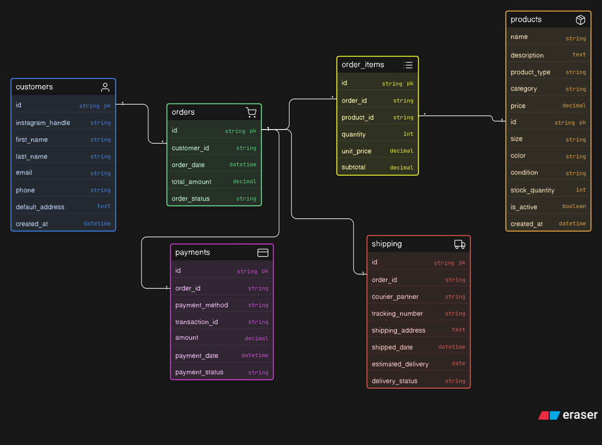

# Instagram Thrift & Handmade Store — Database Design

---

## What's this about?

So the idea here is pretty straightforward — a small business that sells stuff on Instagram. Two types of products: **thrifted items** (usually one-of-a-kind, quantity = 1) and **handmade items** (can be restocked). Customers DM to order, pay via UPI or bank transfer, and the seller ships it out. Simple flow, but there's a lot going on under the hood when you actually sit down to model it.

---

## Entities

| Entity | What it represents |
|---|---|
| `customers` | People who buy — tracked by Instagram handle + contact info |
| `products` | Items for sale — thrifted or handmade, with condition, size, color, stock |
| `orders` | A customer's purchase request — holds status and total |
| `order_items` | The actual line items inside an order (junction table) |
| `payments` | Payment record tied to an order — UPI, bank transfer, etc. |
| `shipping` | Courier details, tracking number, delivery status |

---

## Relationships

- One **customer** can place many **orders** → `1:N`
- One **order** can have many **products** → handled via `order_items` junction table → `M:N`
- One **order** has one **payment** → `1:1`
- One **order** has one **shipping** record → `1:1`

The `order_items` table is the key piece here — it breaks the many-to-many between orders and products, and also stores `unit_price` at time of purchase (so price changes don't mess up old orders).

---

## Keys at a glance

- All PKs are `string` (UUID-style)
- `orders.customer_id` → FK to `customers.id`
- `order_items.order_id` → FK to `orders.id`
- `order_items.product_id` → FK to `products.id`
- `payments.order_id` → FK to `orders.id`
- `shipping.order_id` → FK to `orders.id`

---

## Design decisions worth noting

- `product_type` field distinguishes thrifted vs handmade — affects how `stock_quantity` behaves
- `unit_price` stored in `order_items` separately from `products.price` — intentional, preserves purchase history
- `instagram_handle` on customers because that's literally how this business operates
- `condition` field on products (`mint`, `gently used`, `new`) — makes sense for thrift context

---

## ERD Notation

Built using **crow's foot notation**, pastel color mode.
