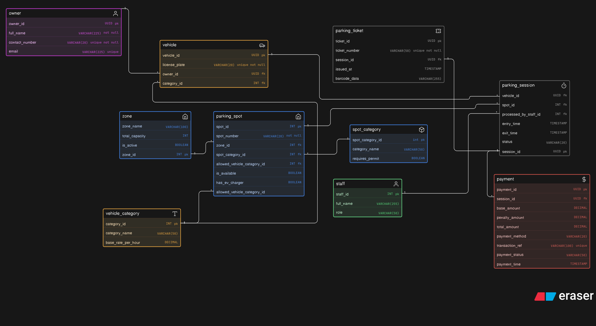

# Comic-Con Parking System — Database Design

---

## What's this about?

A parking management system built specifically for a Comic-Con event — which means it's not just a regular parking lot. You've got VIP spots, cosplayer zones, EV chargers, exhibitor bays, different vehicle types, and staff managing entry/exit. The design had to handle all of that without becoming a mess.

---

## Entities

| Entity | What it represents |
|---|---|
| `owner` | Vehicle owner — name, contact, email |
| `vehicle` | A registered vehicle linked to an owner and category |
| `vehicle_category` | Type of vehicle (Bike, Car) with hourly rate |
| `zone` | Sections of the parking area (North Wing, etc.) |
| `parking_spot` | Individual spot — zone, category, EV charger flag |
| `spot_category` | Type of spot (VIP, EV, Cosplayer, Exhibitor) |
| `staff` | Attendants and managers processing sessions |
| `parking_session` | Active or completed parking session per vehicle |
| `parking_ticket` | Ticket issued at entry — has barcode |
| `payment` | Payment for a session — base + penalty amounts |

---

## Relationships

- `owner` → `vehicle` → `1:N` (one owner, multiple vehicles)
- `vehicle` → `vehicle_category` → `N:1`
- `zone` → `parking_spot` → `1:N`
- `spot_category` → `parking_spot` → `1:N`
- `vehicle_category` → `parking_spot` → `1:N` (allowed vehicle type per spot)
- `vehicle` → `parking_session` → `1:N`
- `parking_spot` → `parking_session` → `1:N`
- `staff` → `parking_session` → `1:N`
- `parking_session` → `parking_ticket` → `1:1`
- `parking_session` → `payment` → `1:N` (handles overstay penalties as separate payments)

---

## Keys at a glance

- `owner.owner_id`, `vehicle.vehicle_id`, `parking_session.session_id`, `parking_ticket.ticket_id`, `payment.payment_id` → UUID PKs
- `vehicle.owner_id` → FK to `owner`
- `vehicle.category_id` → FK to `vehicle_category`
- `parking_spot.zone_id` → FK to `zone`
- `parking_spot.spot_category_id` → FK to `spot_category`
- `parking_spot.allowed_vehicle_category_id` → FK to `vehicle_category`
- `parking_session.vehicle_id`, `parking_session.spot_id`, `parking_session.processed_by_staff_id` → FKs
- `parking_ticket.session_id` → FK to `parking_session`
- `payment.session_id` → FK to `parking_session`

---

## Design decisions worth noting

- `spot_category` and `vehicle_category` are separate — a VIP spot can still be for a car or a bike
- `parking_spot.allowed_vehicle_category_id` enforces which vehicle type can use a spot at the DB level
- `parking_session.status` includes `overstayed` — important for Comic-Con where people lose track of time
- `payment` has both `base_amount` and `penalty_amount` — clean separation for billing logic
- `parking_ticket` with `barcode_data` supports physical/digital ticket scanning at entry

---

## ERD Notation

Built using **crow's foot notation**, pastel color mode.
